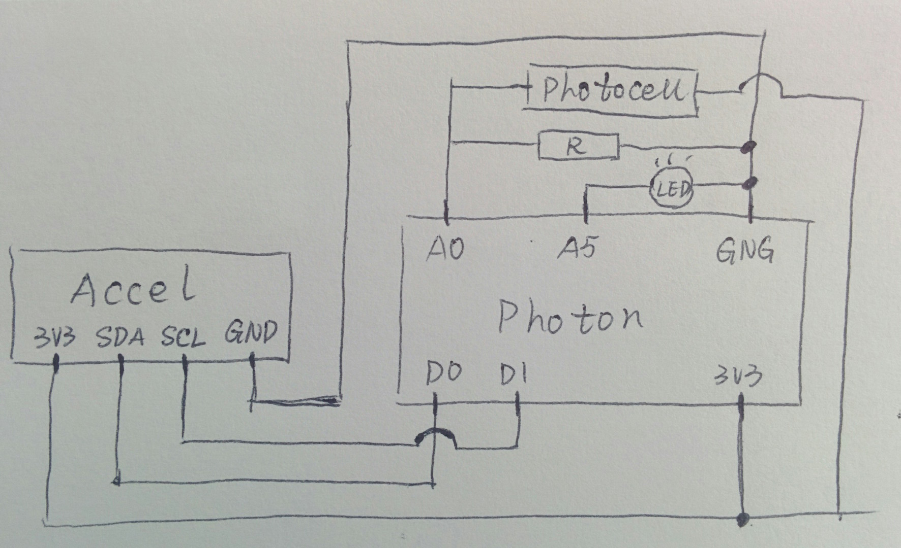

# Lab2
For HCIN720 Lab2Assignment

## A description of circuit: 
  - Sensor: Mini Photocell, SparkFun_MMA8452Q_Accelerometer. 
  - Method:  
    use [professor's code](https://github.com/hcin720-fall15/IA2) to read the data from port3000. 
    use the [SparkFun_MMA8452Q_Particle_Library](https://github.com/sparkfun/SparkFun_MMA8452Q_Particle_Library) to read the accelerator.  
    use `A0` to read the change of Mini Photocell 
    use to get the data from cloud using this [example](https://community.particle.io/t/using-spark-publish-with-simple-json-data/3469) 
  
## A description of your visualization
  - Description: 
    The color of each bubble could manipulate by the data from Accel, right - red, left - green, back - blue 
    The Alpha of each bubble is connected with the lightness 
    When Tapping, new bubble generated 
    In the "Vanish"(SERVER) or "bubble destroyer"(CLOUD) mode, LED light up, and bubbles are destroied by the lightness one by one.  
  - Library: 
    For the chart visualization, use the library [highcharts](http://www.highcharts.com/) 
    For the color ball visualization use the library [paper](http://paperjs.org/) 
  - Difference: 
    Include the highchats for chats visualization, which is really cool~ 
    Using the paper, however with different method. Connecting the orentation with the color, the lightness with the alpha, the tap with new ball.   

## A photograph of circuit 

